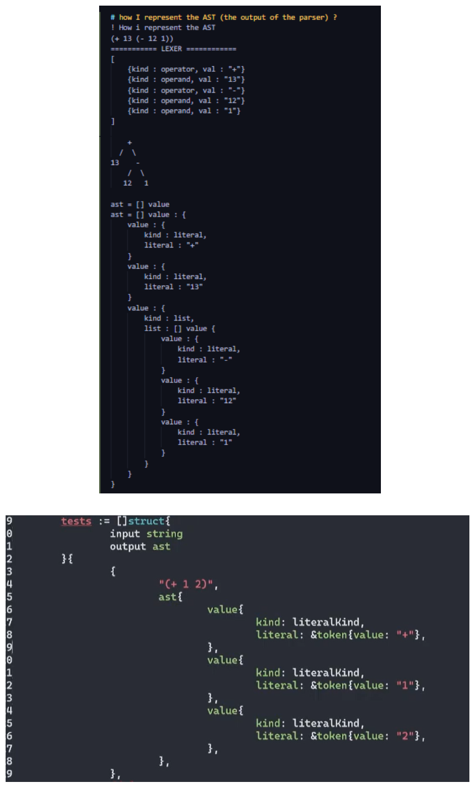

# gosli
gosli (Go scheme-like lang interpreter) 

# what is scheme ?
scheme is simple, wired, and cool, its a type of Lisp family.

## scheme is simple ?
- perform calculation <br>
    `(operator operand_1 operand_2)`
    > (+ 3 4)  <br>
    ```cmd
    7
    ```

    > (+ 5 (* 2 2)) <br>
    ```cmd
    9
    ```

- define a symbol <br>
    `(define symbol_name value)`
    > (define age 20) <br>

    > age <br>
    ```cmd 
    20 
    ```

    > ( + age 5)
    ```cmd
    25
    ```

- define a function <br>
    `define (func_name param) (operator param param))`
    > (define (sq x) (* x x)) <br>

    > (sq 5) <br>
    ```cmd 
    25
    ```

